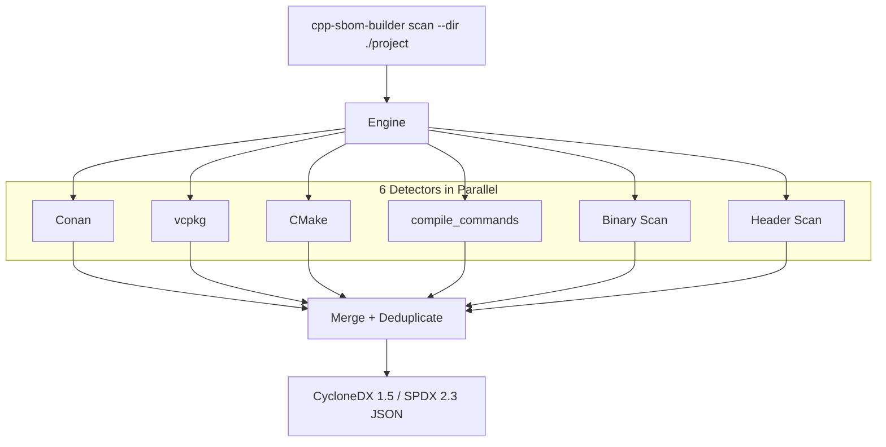

# cpp-sbom-builder

[](https://github.com/tomBold/cpp-sbom-builder/actions/workflows/ci.yml)

A Software Bill of Materials (SBOM) generation engine for C++ projects.
Point it at a project folder and get a **CycloneDX 1.5** or **SPDX 2.3** JSON listing all detected third-party dependencies.

---

## How It Works



**In one sentence:** Scan config files, binaries, and source code -> merge everything by confidence ranking -> write an SBOM JSON.

---

## Prerequisites

- **Go 1.22+** ([download](https://go.dev/dl/))
- **Git** (to clone the repo)

No C++ compiler, CMake, or Conan installation required.

---

## Setup and Run

```bash
git clone https://github.com/tomBold/cpp-sbom-builder.git
cd cpp-sbom-builder
```

### Build

```bash
go build -o cpp-sbom-builder .          # Linux/macOS
go build -o cpp-sbom-builder.exe .      # Windows
```

### Run (CycloneDX format — default)

```bash
./cpp-sbom-builder scan --dir ./demo --verbose
```

### Run (SPDX format)

```bash
./cpp-sbom-builder scan --dir ./demo --format spdx --verbose
```

### Run without building

```bash
go run . scan --dir ./demo --verbose
```

Output is written to the `output/` folder with a timestamped filename (e.g. `output/sbom-cyclonedx-1710512345678.json`).
Use `--output <path>` to write to a specific file, or `--output -` for stdout.

---

## CLI Flags

| Flag                | Description                                     | Default          |
| ------------------- | ----------------------------------------------- | ---------------- |
| `--dir`, `-d`       | Project root directory to scan                  | `.`              |
| `--output`, `-o`    | Output file path (`-` for stdout)               | auto-timestamped |
| `--format`, `-f`    | `cyclonedx` or `spdx`                           | `cyclonedx`      |
| `--verbose`, `-v`   | Print what each detector finds                  | `false`          |
| `--show-strategies` | List which strategies fired                     | `false`          |
| `--min-confidence`  | Only emit components above this score (0.0-1.0) | `0`              |

---

## Sample Output

Pre-generated sample SBOMs from scanning the `demo/` project are in the `samples/` folder:

- [`samples/demo-cyclonedx.json`](samples/demo-cyclonedx.json) -- CycloneDX 1.5
- [`samples/demo-spdx.json`](samples/demo-spdx.json) -- SPDX 2.3

Both contain 13 detected components (boost, openssl, zlib, fmt, spdlog, grpc, libcurl, nlohmann_json, sqlite3, yaml-cpp, abseil, cmake, pugixml) with versions, PURLs, dependency graph edges, and metadata.

---

## Run Tests

```bash
go test ./...
```

Tests cover each detector, the merge engine, confidence filtering, and both SBOM output formats (CycloneDX and SPDX).

---

## Project Structure

```text
cpp-sbom-builder/
├── cmd/root.go                     CLI entry point (Cobra)
├── main.go
├── demo/                           Sample C++ project (triggers all 6 detectors)
├── samples/                        Pre-generated SBOM output examples
├── testdata/fixtures/              Unit test fixtures
├── internal/
│   ├── collector/
│   │   ├── engine.go               Scan engine: runs detectors, merges results
│   │   └── source_info.go          Detector rank, confidence, direct/transitive policy
│   ├── exporter/
│   │   ├── cyclonedx.go            CycloneDX 1.5 JSON output
│   │   └── spdx.go                 SPDX 2.3 JSON output
│   ├── inventory/
│   │   ├── component.go            Component data model
│   │   └── dep_tree.go             Dependency tree builder
│   ├── probers/
│   │   ├── conan.go                Conan detector (lock, txt, py)
│   │   ├── vcpkg.go                vcpkg detector (json, lock, status)
│   │   ├── cmake.go                CMake detector (CMakeLists, CMakeCache)
│   │   ├── compile_commands.go     compile_commands.json detector
│   │   ├── binaries.go             Binary artifact detector (.so, .dll)
│   │   ├── headers.go              Header scan detector (#include)
│   │   ├── detector_name.go        Typed detector name constants
│   │   └── helpers.go              Shared walk + path utilities
│   ├── registry/db.go              Library enrichment catalog (PURLs, descriptions)
│   └── testutil/                   Shared test helpers
└── output/                         Generated SBOM files
```

---

## Detectors

| Detector         | What it reads                                     | Confidence |
| ---------------- | ------------------------------------------------- | ---------- |
| Conan            | `conan.lock`, `conanfile.txt`, `conanfile.py`     | 0.97       |
| vcpkg            | `vcpkg.json`, `vcpkg-lock.json`, installed status | 0.97       |
| compile_commands | `compile_commands.json` (compiler `-I` paths)     | 0.85       |
| CMake            | `CMakeLists.txt`, `CMakeCache.txt`                | 0.80       |
| Binary scan      | `.so`, `.a`, `.dll`, `.lib` filenames             | 0.65       |
| Header scan      | `#include` directives in `.cpp`/`.h` (fallback)   | 0.60       |

When multiple detectors find the same library, the higher-confidence source wins for version and description. Include paths and link libraries are accumulated from all sources.

---

## Guiding Questions

### 1. False Positives — How do you tell stdlib, internal, and third-party headers apart?

| Type | How we filter |
| --- | --- |
| **Stdlib** (`<vector>`, `<iostream>`) | Deny-list of ~80 C/C++ standard header names. Never reported. |
| **Internal** (your own headers) | If the include resolves to a file inside the project root (`include/`, `src/`, `lib/`) it is skipped. Quoted `"foo.h"` includes are skipped. |
| **Third-party** (`<boost/...>`, `<openssl/...>`) | Detected via **path-based inference**: the library name is derived from the include path structure (e.g. `boost/asio.hpp` -> `boost`). A built-in catalog of ~45 popular libraries optionally enriches the result with canonical names, PURLs, and descriptions -- but detection does not depend on it. |

**Other inaccuracies:** Binary scanner only reads filenames. CMake variables like `${DEPS}` are not expanded. `compile_commands.json` may miss generated files. Commented-out lines in `conanfile.py` and `CMakeLists.txt` are stripped before parsing.

### 2. Version Detection — If we only see header files, how do we get the version?

1. **Path** — Include paths often contain the version (e.g. `/opt/zlib-1.2.13/include`). Extracted with a regex.
2. **Version macros** — We scan `version.h`, `config.h` for `#define FOO_VERSION "1.2.3"`.
3. **Binary filename** — Shared libs like `libssl.so.3.1.4` encode the version. We parse it.

The first match wins.

### 3. Performance — 10 GB monorepo: regex, string search, or AST?

**We use regex and string search, not an AST.**

- We only need `#include` lines, not full C++ semantics. Pattern matching is fast and sufficient.
- We skip `.git`, `build`, `vendor`, `node_modules` directories. All 6 detectors run in parallel. Manifest detectors only read a few small files.
- A 10 GB monorepo with ~500k source files should finish in seconds. Use `--min-confidence 0.80` to skip the header scan if it's slow.
